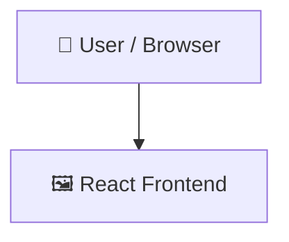

# Temcard

    

## 📑 Table of Contents

- [Description](#description)
- [Tech Stack](#tech-stack)
- [Architecture](#architecture)
- [Quick Start](#quick-start)
- [Key Dependencies](#key-dependencies)
- [Available Scripts](#available-scripts)
- [Project Structure](#project-structure)
- [Development Setup](#development-setup)
- [Goal](#goal)
- [Development](#development)
- [Disclaimer](#disclaimer)
- [License](#license)

## 📝 Description

Web project that showcase the creatures called Temtem from the game with the same name.


## 🛠️ Tech Stack

  

## 🏗️ Architecture

A high-level view of how the main pieces fit together:



## ⚡ Quick Start

```bash

# 1. Clone the repository
git clone http://github.com/juanvic/temcard.git

# 2. Install dependencies
npm install

# 3. Start the dev server
npm run dev
```

## 📦 Key Dependencies

```
gh-pages: ^6.3.0
react: ^19.2.5
react-dom: ^19.2.5
```

## 🚀 Available Scripts

- **dev** — `npm run dev`
- **build** — `npm run build`
- **lint** — `npm run lint`
- **preview** — `npm run preview`
- **predeploy** — `npm run predeploy`
- **deploy** — `npm run deploy`

## 📁 Project Structure

```
.
├── LICENSE
├── eslint.config.js
├── index.html
├── package.json
├── public
│   ├── favicon.svg
│   └── icons.svg
├── src
│   ├── assets
│   │   └── fonts
│   │       ├── Temfont-Regular.otf
│   │       └── Temfont-Regular.ttf
│   ├── components
│   │   ├── Temcard
│   │   │   ├── Temcard.css
│   │   │   └── index.jsx
│   │   └── shared
│   │       └── Footer
│   │           ├── Footer.css
│   │           └── index.jsx
│   ├── index.css
│   └── main.jsx
└── vite.config.js
```

## 🛠️ Development Setup

### Node.js / JavaScript
1. Install Node.js (v18+ recommended)
2. Install dependencies: `npm install` (or `yarn` / `pnpm install` / `bun install`)
3. Start the dev server: see the **Quick Start** above

## Goal
This project showcase the creatures from the game **Temtem** which was released on September of 2022 by Crema, users can see all Temtem avaiable on the game with picture, number of it directly from tempedia and the name in a cool modern way which is responsive and mobile friendly.


## Development
This project has made using Vite + React, also with Javascript and using the fetch method to obtain information of an api developed by [Maael](https://temtem-api.mael.tech/) the api credits goes to they.


## Disclaimer
The game **Temtem** is an MMO in the category of Monster Taming whose objective is to capture and manage monsters in turn-based battles against other players or bots, the game is available for computers and consoles (all trademark rights are reserved to developer Crema Games and the distributor Humble Games), this project does not aim to profit from the brand.

## 👥 Contributing

Contributions are welcome! Here's the standard flow:

1. **Fork** the repository
2. **Clone** your fork: `git clone http://github.com/juanvic/temcard.git`
3. **Branch**: `git checkout -b feature/your-feature`
4. **Commit**: `git commit -m 'feat: add some feature'`
5. **Push**: `git push origin feature/your-feature`
6. **Open** a pull request

Please follow the existing code style and include tests for new behavior where applicable.

## 📜 License

This project is licensed under the **MIT** License.

---


